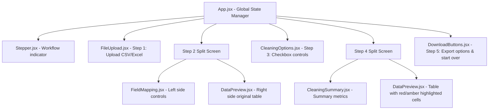

# Implementation Plan — ZoomInfo Lead Data Cleaner

This document details the complete technical specifications and layout for the ZoomInfo Lead Data Cleaner internal web application.

---

## 1. Folder Structure

The application will be built using the exact folder structure specified:

```text
zoominfo-lead-cleaner/
├── backend/
│   ├── app/
│   │   ├── main.py
│   │   ├── routes/
│   │   │   ├── upload.py
│   │   │   ├── clean.py
│   │   │   └── download.py
│   │   ├── services/
│   │   │   ├── file_service.py
│   │   │   ├── cleaning_service.py
│   │   │   ├── export_service.py
│   │   │   └── mapping_service.py
│   │   ├── utils/
│   │   │   ├── validators.py
│   │   │   ├── text_cleaners.py
│   │   │   ├── phone_cleaners.py
│   │   │   ├── linkedin_cleaners.py
│   │   │   └── website_cleaners.py
│   │   └── models/
│   │       ├── request_models.py
│   │       └── response_models.py
│   ├── tests/
│   │   └── test_cleaning.py
│   ├── requirements.txt
│   └── .env.example
├── frontend/
│   ├── src/
│   │   ├── components/
│   │   │   ├── Stepper.jsx
│   │   │   ├── FileUpload.jsx
│   │   │   ├── DataPreview.jsx
│   │   │   ├── FieldMapping.jsx
│   │   │   ├── CleaningOptions.jsx
│   │   │   ├── CleaningSummary.jsx
│   │   │   └── DownloadButtons.jsx
│   │   ├── pages/
│   │   │   └── App.jsx
│   │   ├── services/
│   │   │   └── api.js
│   │   └── utils/
│   │       └── constants.js
│   ├── package.json
│   ├── vite.config.js
│   ├── tailwind.config.js
│   └── .env.example
├── sample_data/
│   ├── messy_zoominfo_sample.csv
│   └── expected_cleaned_output.csv
└── docs/
    ├── implementation_plan.md
    └── README.md
```

---

## 2. API Endpoints

All backend endpoints are implemented in FastAPI and use async definitions (`async def`).

### `GET /`
- **Purpose**: Health check.
- **Response**:
  ```json
  {
    "status": "ok",
    "service": "ZoomInfo Lead Data Cleaner"
  }
  ```

### `POST /upload`
- **Purpose**: Accepts a multipart form file and validates it. Extracts column headers, performs auto-mapping, and saves the file temporarily.
- **Request**: Multipart form data with a single `file` parameter.
- **Validation**:
  - Checks if the file extension is `.csv`, `.xlsx`, or `.xls`.
  - Checks that the file is not empty and has header rows.
- **Response**:
  ```json
  {
    "session_id": "string (uuid)",
    "detected_columns": ["string"],
    "auto_mapping": {
      "Standard Field Name": "Uploaded Column Name"
    },
    "preview_rows": [
      { "col1": "val1", "col2": "val2" }
    ],
    "total_rows": 100,
    "file_name": "leads.csv"
  }
  ```

### `POST /clean`
- **Purpose**: Applies selected cleaning rules to the uploaded file according to custom mapping configurations.
- **Request Body**:
  ```json
  {
    "session_id": "string (uuid)",
    "column_configs": [
      {
        "original_name": "Person First Name",
        "output_name": "First Name",
        "clean_type": "First Name",
        "included": true
      },
      {
        "original_name": "Email Address",
        "output_name": "Email",
        "clean_type": "Email",
        "included": true
      }
    ],
    "cleaning_options": {
      "validate_emails": true,
      "validate_phones": true,
      "clean_linkedin": true,
      "clean_websites": true,
      "remove_duplicates": true,
      "remove_blank_rows": true,
      "generate_invalid_file": true,
      "generate_duplicate_file": true
    }
  }
  ```
- **Response**:
  ```json
  {
    "cleaned_preview": [
      { "First Name": "John", "Email": "john.doe@company.com" }
    ],
    "summary": {
      "total_uploaded": 500,
      "total_after_cleaning": 420,
      "valid_records": 380,
      "needs_review": 30,
      "invalid_records": 10,
      "duplicates_found": 40,
      "duplicates_removed": 40,
      "invalid_emails": 15,
      "invalid_phones": 12,
      "processing_time_ms": 340
    },
    "download_ids": {
      "cleaned": "uuid-cleaned",
      "invalid": "uuid-invalid",
      "duplicates": "uuid-duplicates",
      "summary": "uuid-summary"
    }
  }
  ```

### `GET /download/{file_id}`
- **Purpose**: Downloads a cleaned, invalid, duplicate, or summary report in CSV or XLSX format.
- **Query Params**:
  - `format`: `csv` (default) or `xlsx`
- **Response**: File download stream.

### `DELETE /cleanup/{session_id}`
- **Purpose**: Deletes all temporary uploaded and processed output files associated with a given session ID.
- **Response**: `{ "status": "cleaned_up", "session_id": "uuid" }`

---

## 3. Frontend Component Tree & Data Flow



### Global State Shape
```json
{
  "step": 1,
  "sessionId": null,
  "uploadedFile": null,
  "detectedColumns": [],
  "autoMapping": {},
  "columnConfigs": [],
  "previewRows": [],
  "totalRows": 0,
  "cleaningOptions": {
    "validate_emails": true,
    "validate_phones": true,
    "clean_linkedin": true,
    "clean_websites": true,
    "remove_duplicates": true,
    "remove_blank_rows": true,
    "generate_invalid_file": true,
    "generate_duplicate_file": true
  },
  "cleanedPreview": [],
  "summary": {},
  "downloadIds": {}
}
```

---

## 4. Cleaning Logic Pseudocode

### Name Cleaning
```python
def clean_name(value):
    if not value or pd.isna(value):
        return ""
    val = str(value).strip()
    val = " ".join(val.split()) # Collapse multiple spaces
    val = val.title()
    val = re.sub(r"[^A-Za-z\s\-\'\.]", "", val)
    return val

# Full Name generation
if not full_name_val and first_name_val and last_name_val:
    full_name_val = f"{first_name_val} {last_name_val}"
```

### Email Cleaning & Validation
```python
def clean_email(value):
    if not value or pd.isna(value):
        return "", False
    val = str(value).strip().lower()
    regex = r"^[a-zA-Z0-9._%+\-]+@[a-zA-Z0-9.\-]+\.[a-zA-Z]{2,}$"
    is_valid = bool(re.match(regex, val))
    return val, is_valid
```

### Phone Cleaning & Validation
```python
def clean_phone(value):
    if not value or pd.isna(value):
        return "", False
    val = str(value).strip()
    # Keep leading + if present, strip all other non-digits
    has_plus = val.startswith("+")
    digits = "".join(c for c in val if c.isdigit())
    cleaned = ("+" if has_plus else "") + digits
    
    # Validation: digit count should be between 7 and 15
    is_valid = 7 <= len(digits) <= 15
    return cleaned, is_valid
```

### LinkedIn URL Cleaning
```python
def clean_linkedin(value):
    if not value or pd.isna(value):
        return "", False
    val = str(value).strip()
    # Remove query params
    if "?" in val:
        val = val.split("?")[0]
    # Remove trailing slash
    val = val.rstrip("/")
    # Normalize prefixes
    if val.startswith("linkedin.com/"):
        val = "https://www." + val
    elif val.startswith("www.linkedin.com/"):
        val = "https://" + val
    
    is_valid = val.startswith("https://www.linkedin.com/in/") or val.startswith("https://www.linkedin.com/company/")
    return val, is_valid
```

### Website Cleaning
```python
def clean_website(value):
    if not value or pd.isna(value):
        return "", False
    val = str(value).strip().lower()
    # Ensure scheme
    if not (val.startswith("http://") or val.startswith("https://")):
        val = "https://" + val
    val = val.rstrip("/")
    
    is_valid = val.startswith("http://") or val.startswith("https://")
    return val, is_valid
```

### Company Name Cleaning
```python
def clean_company(value):
    if not value or pd.isna(value):
        return ""
    val = str(value).strip()
    val = " ".join(val.split())
    # Proper casing but preserving known uppercase suffixes
    val = val.title()
    suffixes = {"Inc": "Inc", "Llc": "LLC", "Ltd": "Ltd", "Corp": "Corp", "Pvt": "Pvt", "Co.": "Co."}
    words = val.split()
    for i, word in enumerate(words):
        if word in suffixes:
            words[i] = suffixes[word]
    return " ".join(words)
```

### Location Normalization
```python
COUNTRY_MAP = {
    "usa": "United States", "us": "United States", "u.s.a.": "United States",
    "united states of america": "United States", "uk": "United Kingdom",
    "u.k.": "United Kingdom", "uae": "United Arab Emirates"
}

def clean_location(value, is_country=False):
    if not value or pd.isna(value):
        return ""
    val = str(value).strip()
    if is_country:
        low_val = val.lower()
        if low_val in COUNTRY_MAP:
            return COUNTRY_MAP[low_val]
    return val.title()
```

---

## 5. Test Plan

Pytest is used for verifying cleaning logic and server endpoints.

1. **Unit Tests for Validators & Cleaners**:
   - Verify email validation on edge cases.
   - Verify phone sanitization and length check.
   - Verify LinkedIn normalization, prefix addition, and tracking parameter removal.
   - Verify location mapping logic.

2. **Integration Tests for Cleaning Service**:
   - Deduplication: Test email matching, LinkedIn profile URL matching, and name+company matching.
   - Blank rows: Verify that rows with all mapped columns blank are deleted.
   - Excel export: Validate OpenPyXL workbook layout (freeze panel, cell formatting).

3. **API Tests**:
   - `POST /upload` with `.csv` and `.xlsx` payloads.
   - `POST /upload` with unsupported extensions (assert `400 Bad Request`).
   - `POST /clean` with custom mappings and active options.
   - `GET /download/{file_id}` serving files in CSV/XLSX.
